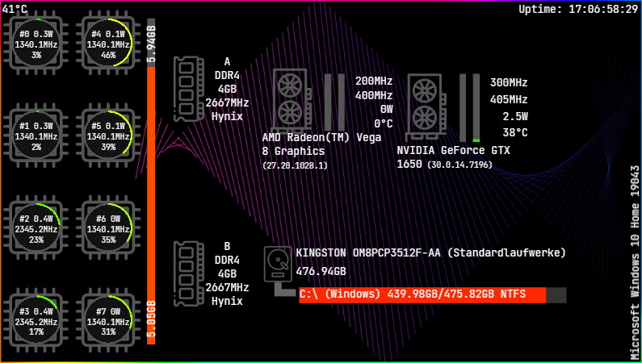
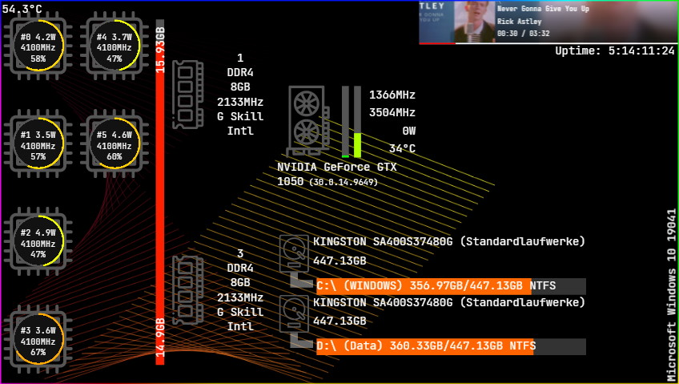

# System-Monitoring

This is a little project to just display some stats of your PC.

## Setting up
To make it work you want to install [OpenHardware Monitor](https://openhardwaremonitor.org/).  
In OpenHardware Monitor go to Options > Remote Web Server and enable Run.  
Next go to Options > Remote Web Server > Port and change the port to 8085.

Install Java 11 or later (not tested with lower versions).  
Download the jar from the latest [release](https://github.com/Redstonecrafter0/System-Monitoring/releases).

When running the jar a webserver starts and servers everything else needed.
You can just open Chrome and go to `http://localhost:1234`.
The default port is 1234, but you can change it by setting the environment variable `PORT` to any other number in the port range.

The webpage was designed for a 480p screen so use a screen of 480p for an optimal image.
Anyway it should work with every other screen resolution.

### Chrome Extension
In case you also want to display data from [YouTube Music](https://music.youtube.com) you have to also download the ChromeExtension.zip from the latest release.  
After that you unzip that file to a folder where it can be.  
To install that to Chrome you type the url `chrome://extensions` in Chrome.  
Next you click on the top left button that says `Load unpacked` and select the folder where you extracted the zip file before and the `manifest.json` is inside.  
I didn't find a way to disable that annoying logging of the broken connection on the dev console of Chrome on YouTube Music so don't wonder.

